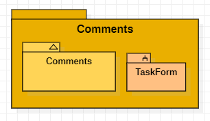

Rama de Christian Pardavé Espinoza:

- Test vista tasks.
- Implementación de comentarios en tareas públicas.

Para la adición de comentarios en las tareas se creó la aplicación _comments_ dentro de django, para separar sus metodos de la aplicación _tasks_. Para esta implementación se identificó los modulos del proyecto.

