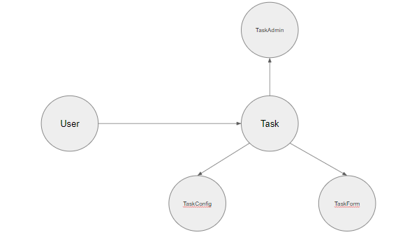

# INTEGRANTES:
- Diego Francisco Apaza Andaluz (Rama_Diego)
- Christian Pardavé Espinoza (rama-christian)
- Eduardo German Ruiz Mamani (rama_Eduardo_real)
- Sergio Sebastian Santos Mena Quispe (rama-Sergio)
# Gestor de Tareas

Este proyecto es una aplicación web para la gestión de tareas personales. Permite a los usuarios crear, organizar y priorizar sus tareas diarias de manera efectiva.
## Tecnologías Utilizadas
- Django (Framework de Python para desarrollo web)
- SQLite (Base de datos)
- HTML/CSS (Frontend)
- Bootstrap (Framework de CSS)

# Trello:

https://trello.com/b/fbrJG4IH/proyecto-final

## Características

- Registro e inicio de sesión de usuarios.
- Creación y gestión de tareas personales.
- Marcar tareas como importantes.
- Visualizar y editar tareas pendientes.
- Registrar tareas completadas con fecha de finalización.
- Navegación intuitiva a través de un menú de usuario.

## Instalación y Ejecución

Primero tener descargado sqlite e iniciar el ejecutable de sqlite3.
[Link de descarga del .zip](https://www.sqlite.org/2023/sqlite-tools-win-x64-3440200.zip)


1. `pip install -r requirements.txt`
2. `python manage.py makemigrations`
3. `python manage.py migrate`
4. `python manage.py createsuperuser`
5. `python manage.py runserver`
6. Ingresar a tu navegador en el puerto 8000 [http://127.0.0.1:8000/](http://127.0.0.1:8000/)

<<<<<<< HEAD
## Contribuciones Específicas 

### Adicion de una fecha limite

Se agrego una opcion para agregar una fecha limite en caso de necesitarla. 

### Tareas Públicas (Public Tasks)

Desarrollo de la funcionalidad "Tareas Públicas" (Public Tasks). Esta característica permite a los usuarios marcar sus tareas como públicas, haciéndolas accesibles a todos los usuarios de la plataforma. Fomenta la colaboración y transparencia, y añade una dimensión comunitaria a la gestión de tareas.


### FEATURE PROGRESS BAR 

Se agrego el feature de una barra de progreso de tareas completadas y por completar.

```python

@login_required
def tasks(request):
    tasks = Task.objects.filter(user=request.user, datecompleted__isnull=True)
    tasks_completed = Task.objects.filter(user=request.user, datecompleted__isnull=False)

    count_completed = tasks_completed.count()
    count_not_completed = tasks.count()

    return render(request, 'tasks.html', {"tasks": tasks, "count_total": count_completed + count_not_completed, "count_completed": count_completed})


@login_required
def tasks_completed(request):
    tasks = Task.objects.filter(user=request.user, datecompleted__isnull=False).order_by('-datecompleted')
    
    tasks_not_completed = Task.objects.filter(user=request.user, datecompleted__isnull=True)
    count_not_completed = tasks_not_completed.count()
    count_completed = tasks.count()
    
    return render(request, 'tasks.html', {"tasks": tasks, "count_total": count_completed + count_not_completed, "count_completed": count_completed})

```

- Test vista tasks.
- Implementación de comentarios en tareas públicas.


Para la adición de comentarios en las tareas se creó la aplicación _comments_ dentro de django, para separar sus metodos de la aplicación _tasks_. Para esta implementación se identificó los modulos del proyecto.


## MÓDULO AUTH

Se agrego el módulo de "auth", en el que se incluyeron funciones como el "sigin", "signout", y "signup".

```python

def signup(request):
    if request.method == 'GET':
        return render(request, 'signup.html', {"form": UserCreationForm})
    else:

        if request.POST["password1"] == request.POST["password2"]:
            try:
                user = User.objects.create_user(
                    request.POST["username"], password=request.POST["password1"])
                user.save()
                login(request, user)  # Replace LoginFailure with login
                return redirect('tasks')
            except IntegrityError:
                return render(request, 'signup.html', {"form": UserCreationForm, "error": "Username already exists."})

        return render(request, 'signup.html', {"form": UserCreationForm, "error": "Passwords did not match."})


def signin(request):
    if request.method == 'GET':
        return render(request, 'signin.html', {"form": AuthenticationForm})
    else:
        user = authenticate(
            request, username=request.POST['username'], password=request.POST['password'])
        if user is None:
            return render(request, 'signin.html', {"form": AuthenticationForm, "error": "Username or password is incorrect."})

        login(request, user)
        return redirect('tasks')

@login_required
def signout(request):
    logout(request)
    return redirect('home')


```


# Pruebas Unitarias
# Creacion de pruebas unitarias para el uso de fechas en la creacion de una nueva tarea:


Verifica que la fecha de creación de una tarea sea una fecha valida


Además, se implemento varios casos de prueba para asegurar la funcionalidad y robustez de la aplicación. Estos tests incluyen:

- Pruebas para la creación de tareas, tanto con datos válidos como inválidos.
- Verificación del funcionamiento correcto del formulario de creación de tareas.
- Tests para la lógica de visualización y manejo de tareas públicas.

Estos casos de prueba fueron fundamentales para mantener la calidad y estabilidad del software durante el desarrollo.


Se hizo una prueba de test para comprobar que la barra de progreso exista.
=======

# PROGRESO DE DISEÑO 

Se diseño una nueva intefas para el login.

```python

<style>
@media screen and (min-width: 480px) {
    #form {
        width: 400px;
    }
}

@-webkit-keyframes animatebottom {
    0% {
        opacity: 0;
        margin-top: 500px;
    }
    100% {
        opacity: 1;
        margin-top: 0px;
    }
}

@keyframes animatebottom {
    0% {
        opacity: 0;
        margin-top: 500px;
    }
    100% {
        opacity: 1;
        margin-top: 0px;
    }
}

input {
    color: #888;
    margin: 5px;
    border-radius: 0px;
    border: 0px solid #eee;
    padding: 8px;
    background: #eee;
    transition-duration: .5s;
}

input:focus {
    border-radius: 50px;
    background-color: #ccc;
    color: #fff;
}

a {
    text-decoration: none !important;
    color: #fff;
}

hr {
    border: 2px solid #c1c1c1;
}

button {
    cursor: hand;
    border: none;
    background: #27a5df;
    color: white;
    padding: 11px 26px;
    border-radius: 5px;
    font-size: 16px;
    transition-duration: .1s;
}

button:active {
    background-color: #555;
}

* {
    outline: none;
    user-select: none;
}

h1 {
    width: 100%;
    color: #888;
}

#form {
    outline: 15px solid #4bbaed;
    margin: 20px;
    border-radius: 10px;
    text-align: -webkit-center;
    background: rgba(255, 255, 255, 1);
    padding: 30px 10px;
    border-top: 30px solid #27a5df;
    border-bottom: 30px solid #27a5df;
    box-shadow: -1px 1px 20px rgba(0, 0, 0, 0.5);
    border: none;
    outline: none;
    animation: animatebottom 1s cubic-bezier(1, -0.06, 0.26, 1.06);
}

body {
    -webkit-user-select: none;
    -moz-user-select: none;
    -ms-user-select: none;
    user-select: none;
    background-image: url("https://images.pexels.com/photos/1587/blurred-background.jpg?auto=compress&cs=tinysrgb&dpr=2&w=5000");
    background-attachment: fixed;
    background-position: bottom left;
    background-repeat: no-repeat;
    background-size: cover;
    transition: 1s;
    padding: 10px;
    margin: 0;
    color: #888;
    font-family: Consolas, "Andale Mono", "Lucida Console", "Lucida Sans Typewriter", Monaco, "Courier New", "monospace";
    text-align: -webkit-center;
}

/* Changed footer - August 2020 */
footer {
    padding: 15px 15px;
    width: 80%;
    position: fixed;
    bottom: 2%;
    left: 50%;
    transform: translate(-50%, -50%);
    background-color: #fff;
    text-align: -webkit-center;
    color: #fff!important;
    border-radius: 50px;
    color: #fff;
    background-color: rgba(255, 255, 255, 0.25);
}

header h1 {
    width: 90%;
    border: 5px dotted #27a5df;
    color: #27a5df;
    text-align: -webkit-center;
    border-radius: 5px;
}

</style>
```


### CASOS DE PRUEBA

Se hizo una prueba de test para comprobar la existencia de usuarios y la de no usuarios.
>>>>>>> rama-Paolo


```python
class TasksTestCase(LiveServerTestCase):
    def setUp(self):
        # Configuración del navegador Selenium (puedes ajustar según tus necesidades)
        chrome_options = Options()
        # chrome_options.add_argument("--headless")  # Ejecución en modo sin cabeza para pruebas en segundo plano
        self.selenium = webdriver.Chrome(options=chrome_options)
        self.selenium.implicitly_wait(10)  # Espera implícita de 10 segundos
        super(TasksTestCase, self).setUp()

    def tearDown(self):
        self.selenium.quit()
        super(TasksTestCase, self).tearDown()

    def test_tasks_page(self):
        # Crear un usuario y tareas para ese usuario
        user = User.objects.create_user(username='testuser', password='testpass')
        Task.objects.create(user=user, description='Task 1')

<<<<<<< HEAD
        # Acceder a la página de tareas con Selenium
        self.selenium.get(f'{self.live_server_url}/signup/')
        self.selenium.find_element(By.NAME, 'username').send_keys('mena3')
        self.selenium.find_element(By.NAME, 'password1').send_keys('123qweop')
        self.selenium.find_element(By.NAME, 'password2').send_keys('123qweop')
        self.selenium.find_element(By.NAME, 'password2').send_keys(Keys.ENTER)
    
        # Verificar que la página de tareas se carga correctamente
        self.assertIn('tasks', self.selenium.find_element(By.CSS_SELECTOR, "h1").text.lower())
        
=======
        # Acceder a la página de login para verificar un usuario existente.
        self.selenium.get(f'{self.live_server_url}/signin/')
        self.selenium.find_element(By.NAME, 'username').send_keys('marisol')
        self.selenium.find_element(By.NAME, 'password').send_keys('123456')
        self.selenium.find_element(By.NAME, 'password').send_keys(Keys.ENTER)
    
        # Verificar que la página de tareas se carga correctamente
        self.assertIn('tasks', self.selenium.find_element(By.CSS_SELECTOR, "h1").text.lower())

>>>>>>> rama-Paolo
        WebDriverWait(self.selenium, 10).until(
            EC.presence_of_element_located((By.TAG_NAME, 'progress'))
        )

<<<<<<< HEAD
        # Verificar que la tarea se muestra en la página
        progress_bar = self.selenium.find_element(By.TAG_NAME, 'progress')
        self.assertIsNotNone(progress_bar, 'Progress bar not found')


        WebDriverWait(self.selenium, 10).until(
            EC.presence_of_element_located((By.ID, 'progress-message'))
        )

        progress_message = self.selenium.find_element(By.ID, 'progress-message')
        self.assertIn('Tasks completed 0/0', progress_message.text)
```


## Lenguaje ubicuo:


**Modelo (Task):** Se utiliza el término "Task" para referirse al modelo.el término "Task" representa la entidad que está siendo modelada en la base de datos.

**ModelForm:** El nombre TaskForm comunica que este formulario está específicamente diseñado para el modelo Task. Utilizar "Form" al final del nombre es una convención común para los formularios basados en modelos en Django.

**Meta:** En Django, la clase Meta se utiliza para proporcionar metainformación sobre el formulario, como el modelo al que está vinculado y los campos que deben incluirse.

**fields = ['title', 'description', 'important', 'fecha_limite']:** Al especificar los campos que deben incluirse en el formulario, se sigue utilizando el lenguaje del modelo. En este caso, los campos son 'title', 'description', 'important', y 'fecha_limite', que son los mismos campos definidos en el modelo Task.


**title:** Un campo de caracteres que almacena el título de la tarea con una longitud máxima de 200 caracteres.

**description:** Un campo de texto más largo que almacena la descripción de la tarea con una longitud máxima de 1000 caracteres.

**created:** Un campo de fecha y hora que se establece automáticamente en la fecha y hora actual cuando se crea la tarea.

**datecompleted:** Un campo de fecha y hora que puede ser nulo y en blanco. Almacena la fecha y hora en que se completó la tarea.

**important:** Un campo booleano que indica si la tarea es importante o no. El valor predeterminado es False.

**user:** Una clave externa que se relaciona con el modelo de usuario (User). Utiliza on_delete=models.CASCADE, lo que significa que si un usuario se elimina, también se eliminarán todas sus tareas asociadas.

**fecha_limite:** Un campo de fecha que puede ser nulo y en blanco. Almacena la fecha límite para la tarea.

**def __str__(self)::** Un método que devuelve una representación de cadena del objeto. En este caso, devuelve una cadena que combina el título de la tarea y el nombre de usuario del propietario.


# MODELO DE DOMINIO

El modelo de dominio se centra en el dominio de "Task", del cual se extienden otros modelos como "TaskAdmin", "TaskForm", y "TaskConfig", y también otro modelo "User" que administras las tasks.




=======
        # Acceder a la página de login para verificar un usuario no existente.
        self.selenium.get(f'{self.live_server_url}/signin/')
        self.selenium.find_element(By.NAME, 'username').send_keys('marisol')
        self.selenium.find_element(By.NAME, 'password').send_keys('123')
        self.selenium.find_element(By.NAME, 'password').send_keys(Keys.ENTER)
    
        # Verificar que la página de tareas se carga correctamente
        self.assertIn('tasks', self.selenium.find_element(By.CSS_SELECTOR, "h1").text.lower())

        WebDriverWait(self.selenium, 10).until(
            EC.presence_of_element_located((By.TAG_NAME, 'progress'))
        )

        progress_message = self.selenium.find_element(By.ID, 'progress-message')
        self.assertIn('Completed 0/0', progress_message.text)
```
### MODELO DE DOMINIO

Modelo de Dominio:
*Entidades:
Usuario
Tarea
Progreso

*Atributos:
Usuario: ID, Nombre, Correo Electrónico, Contraseña
Tarea: ID, Descripción, Estado (pendiente, completada, en progreso), Fecha de Creación, Fecha de Vencimiento
Progreso: ID, ID del Usuario, Tareas Completadas

*Relaciones:
Un Usuario puede tener varias Tareas.
Un Usuario puede tener un Progreso asociado.


### MICROSERVICIOS IDENTIFICADOS

1. Microservicio de Autenticación y Registro:

   Funcionalidades:
   - Iniciar sesión con correo electrónico y contraseña.
   - Registrarse como nuevo usuario.

   Contexto delimitado: Autenticación

   Responsabilidades:
   - Validar credenciales de usuario.
   - Generar y gestionar tokens de sesión.
   - Registro y gestión de usuarios.

2. Microservicio de Gestión de Tareas:

   Funcionalidades:
   - Crear nuevas tareas con descripción, fecha de creación y fecha de vencimiento.
   - Marcar tareas como pendientes, en progreso o completadas.
   - Visualizar la lista de tareas propias.
   - Visualizar las tareas de otros usuarios.

   Contexto delimitado: Gestión de Tareas

   Responsabilidades:
   - Crear y gestionar tareas.
   - Asociar tareas a usuarios.
   - Cambiar estados de tareas.

3. Microservicio de Progreso del Usuario:

   Funcionalidades:
   - Seguimiento del progreso general del usuario.
   - Visualización de la cantidad de tareas completadas.

   Contexto delimitado: Progreso del Usuario

   Responsabilidades:
   - Seguimiento del progreso general del usuario.
   - Registrar y actualizar tareas completadas.

4. Microservicio de Gestión de Usuarios:

   Funcionalidades:
   - Actualizar información del perfil.
   - Cambiar la contraseña.

   Contexto delimitado: Perfil del Usuario

   Responsabilidades:
   - Actualizar información del perfil del usuario.
   - Cambiar la contraseña del usuario.

5. Microservicio de Sesión de Usuario:

   Funcionalidades:
   - Cerrar sesión.

   Contexto delimitado: Sesión de Usuario

   Responsabilidades:
   - Iniciar y cerrar sesiones de usuario.
   - Gestionar tokens de sesión.


>>>>>>> rama-Paolo
